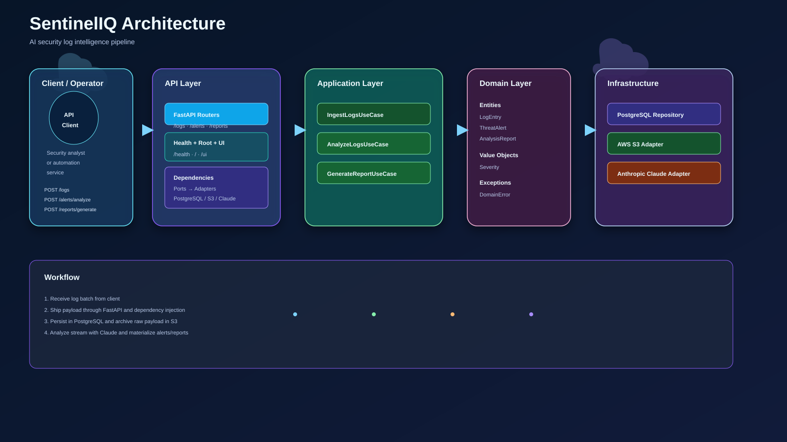

# SentinelIQ

**AI-powered security log intelligence platform.** SentinelIQ ingests
network/security log data, stores it in PostgreSQL, archives raw
batches to AWS S3, and uses the Claude API to detect anomalies and
generate plain-English incident reports — turning a pile of log lines
into something a human can actually act on.

## Why this project

Log data is abundant and unreadable at scale. SentinelIQ demonstrates
a full, production-shaped slice of that problem: structured storage,
durable archival, and an LLM doing the part humans are worst at —
reading thousands of repetitive entries and noticing the handful that
matter.

## Tech stack

| Concern              | Choice                                   |
|-----------------------|-------------------------------------------|
| API framework          | FastAPI (async)                          |
| Database                | PostgreSQL, via SQLAlchemy 2.0 (async) + Alembic migrations |
| Object storage           | AWS S3 (boto3), for raw log/report archival |
| AI analysis              | Claude (Anthropic API) — anomaly detection + natural-language summaries |
| Testing                   | pytest + pytest-asyncio, with fakes for every port (no live DB/AWS/Claude needed for unit tests) |
| Containerization           | Docker + docker-compose (API + PostgreSQL) |
| CI                          | GitHub Actions (lint, type-check, test) |

## Architecture: hexagonal (ports & adapters)



This project deliberately avoids MVC. It's structured as four
concentric layers, dependencies pointing inward only:

```
src/sentineliq/
├── domain/            Pure business entities (LogEntry, ThreatAlert,
│                       AnalysisReport) and rules. Zero framework imports.
├── application/        Use cases (IngestLogs, AnalyzeLogs,
│   ├── ports/           GenerateThreatReport) orchestrating the domain
│   └── use_cases/        through abstract ports — LogRepositoryPort,
│                          ObjectStoragePort, AIAnalysisPort, etc.
├── infrastructure/      Concrete adapters implementing those ports:
│   ├── persistence/      PostgresLogRepository / PostgresAlertRepository
│   ├── aws/                (SQLAlchemy), S3ObjectStorageAdapter (boto3),
│   ├── ai/                  ClaudeAnalysisAdapter (anthropic SDK).
│   └── config/
└── interfaces/
    └── api/               FastAPI: routers, Pydantic schemas, and the
                            dependency-injection wiring that binds ports
                            to adapters (interfaces/api/dependencies.py).
```

**Why this matters in practice:** the application layer never imports
SQLAlchemy, boto3, or the anthropic SDK. Every use case is unit-tested
against in-memory fakes (see `tests/conftest.py` and `tests/unit/`) —
no database, AWS credentials, or Anthropic API key required to run the
core test suite. Swapping PostgreSQL for something else, or Claude for
a different model provider, means writing one new adapter class, not
touching business logic.

## API surface (v0.1)

| Method & path              | Purpose                                             |
|------------------------------|-------------------------------------------------------|
| `POST /logs`                   | Ingest a batch of log entries                        |
| `GET /logs`                     | List recent log entries                              |
| `POST /alerts/analyze`           | Run anomaly detection over the recent log window     |
| `GET /alerts`                     | List unacknowledged threat alerts                    |
| `POST /reports/generate`           | Generate a natural-language incident summary for a period |
| `GET /health`                        | Liveness check                                       |

Interactive docs are available at `/docs` once the app is running
(FastAPI's built-in Swagger UI).

## Getting started

### 1. Configure environment

```bash
cp .env.example .env
# fill in DATABASE_URL (if not using docker-compose), AWS credentials,
# AWS_S3_BUCKET, and ANTHROPIC_API_KEY
```

### 2. Run with Docker (recommended)

```bash
docker compose -f docker/docker-compose.yml up --build
```

This starts PostgreSQL and the API together. The API is then
reachable at `http://localhost:8000`.

### 3. Or run locally

```bash
python -m venv .venv && source .venv/bin/activate
pip install -e ".[dev]"

# apply database migrations
alembic upgrade head

# (optional) seed a few sample log entries
python scripts/seed_data.py

uvicorn sentineliq.interfaces.api.main:app --reload
```

### 4. Run the tests

```bash
pytest                          # unit + integration tests
pytest --cov=sentineliq         # with coverage
```

Unit tests (`tests/unit/`) run against fakes and need no external
services. The integration test (`tests/integration/`) boots the real
FastAPI app in-process (via `httpx.ASGITransport`) but only exercises
`/health`, so it doesn't need a database either.

## Project status & next steps

This repository is a **deliberately minimal, working base** — every
layer is wired end-to-end and testable, but the feature set is
intentionally small. See [`docs/ROADMAP.md`](docs/ROADMAP.md) for the
prioritized list of what to build next.

## License

MIT — see [`LICENSE`](LICENSE).
